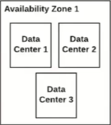
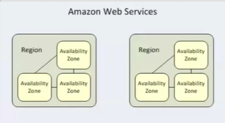
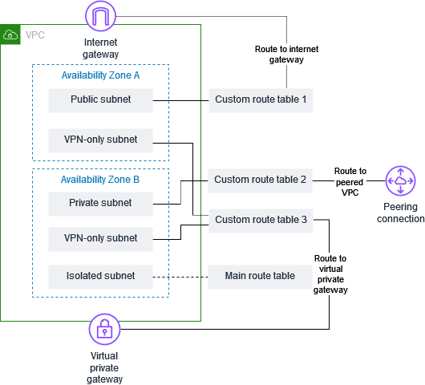
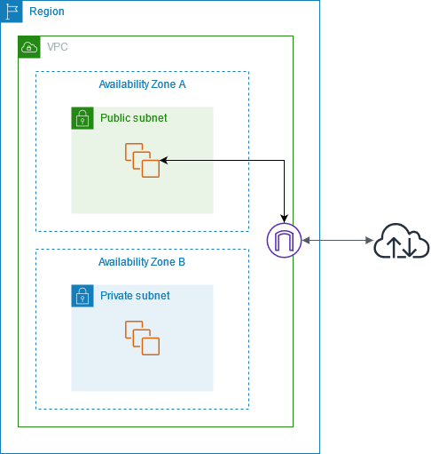

**Availability Zones (AZ)**  

    Availability Zone = AWS Data Center
    Each AZ is physically separated but are connected via high speed, low latency private links within the region.
    So we can think of it as "private connectivity inside the region".
    There are 123 Availability Zones (AZs).

**Regions**  

    Region is a geographical area that contains multiple Availability Zones (AZs).
    Each Region contains 2 or more Availability Zones (usually at least 3).
    AWS has 39 Regions globally till now.

**Virtual Private Cloud (VPC)**

    Virtual Private Cloud (VPC) = a private virtual network in AWS where we can launch our resources.
    Basically VPC is our own network in cloud which is isolated from other AWS users.
    This virtual network is like the same network of our traditional data center, with the benefits of scalable infrastructure of AWS.

**Subnets**  

    A subnet is a range of IP addresses in your VPC. A subnet must exist in a single Availability Zone. After we add subnets, we can
    deploy AWS resources in our VPC. We can assign both IPv4 and IPv6 addresses, to our VPCs and subnets.
    
    If a subnet is associated with a route table that has a route to an internet gateway, it's known as a public subnet. If a subnet is
    associated with a route table that does not have a route to an internet gateway, it's known as a private subnet.

**Route Table**  

    A route table serves as the traffic controller for our VPC. Each route table contains a set of routes, that determine where network
    traffic from our subnet or gateway is directed. Each route specifies a destination and a target. We must add our desired subnets
    (public subnets, private subnets) in the route table via subnet association to define how traffic flows for those subnets.
    
    Here,
    Destination = The range of IP addresses where we want traffic to go.
    Target = The gateway, network interface, or connection through which traffic will be sent to its destination.

**Internet Gateway**

    An internet gateway is a VPC component that allows communication between our VPC and the internet. It supports IPv4 and IPv6 traffic.
    An internet gateway enables resources in our public subnets (such as EC2 instances) to connect to the internet if the resource has a
    public IPv4/IPv6 address. For example, an internet gateway enables us to connect to an EC2 instance in AWS using our local computer.
    To use an internet gateway, we must attach it to a VPC and configure routing in route table.
    
  
    
    In the following diagram, the subnet in Availability Zone A is a public subnet because its route table has a route that sends all
    internet-bound IPv4 traffic to the internet gateway. The instances in the public subnet must have public IP addresses or Elastic IP
    addresses to enable communication with the internet over the internet gateway. For comparison, the subnet in Availability Zone B is a
    private subnet because its route table does not have a route to the internet gateway. Because there is no route to the internet
    gateway, instances in the private subnet can't communicate with the internet, even if they have public IP addresses.
